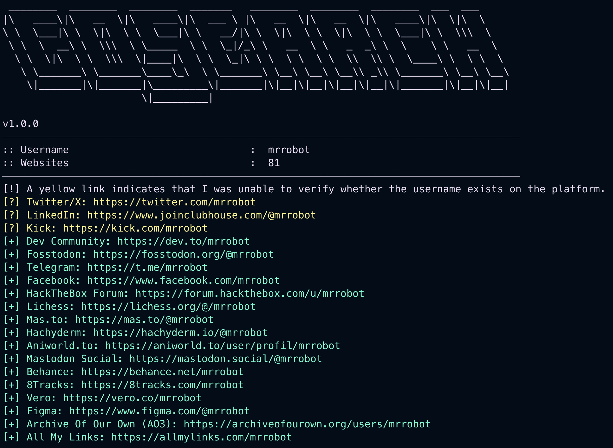
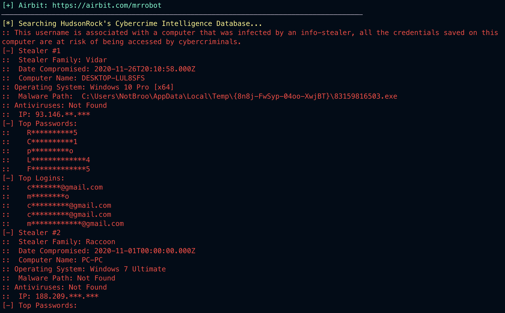
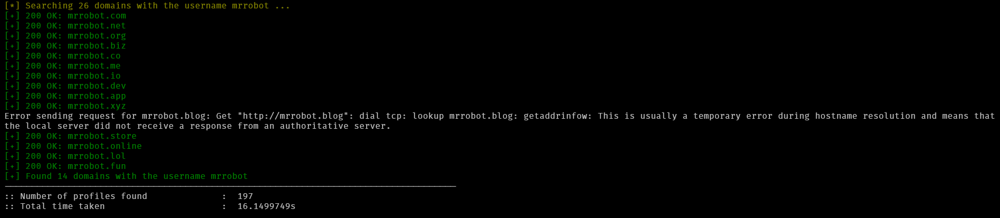

<p align='center'>
<br>
<i>This project heavily relies on contributors, please see <a href="#contributing">Contributing</a> for more details.</i><br>
<code>go install github.com/ibnaleem/gosearch@latest</code>
</p>

<p align="center">
        
</p>
<hr>

## What is `GoSearch`?
<p align='center'>
<br>
<br>
<br>
<br>
</p>

`GoSearch` is an efficient and reliable OSINT tool designed for uncovering digital footprints associated with a given username. It's fast, straightforward, and dependable, enabling users to track an individual's online presence across multiple platforms. `GoSearch` also integrates data from HudsonRock's Cybercrime Intelligence Database to provide insights into cybercrime-related information. It also taps into [`BreachDirectory.org`](https://breachdirectory.org)'s database offering access to a comprehensive list of data breaches, plain-text and hashed passwords linked to the username. This tool is ideal for those needing accurate, no-frills results when investigating online identities.

## Installation & Usage
```
$ go install github.com/ibnaleem/gosearch@latest
```
### Unix:
```
$ gosearch [username]
```
### Windows
```
C:\Users\Bob> gosearch.exe [username]
```
## Use Cases
GoSearch allows you to search [BreachDirectory](https://breachdirectory.org) for compromised passwords associated with a specific username. To fully utilise GoSearch, follow these steps:

1. Obtain a **free** API key from `https://rapidapi.com/rohan-patra/api/breachdirectory`.
2. Include the API key in the command arguments like this:
```
$ gosearch [username] [api-key]
```
If GoSearch finds password hashes, it will attempt to crack them using [Weakpass](https://weakpass.com). The success rate is nearly 100%, as Weakpass uses a large wordlist of common data-wells, which align with the breaches reported by [BreachDirectory](https://breachdirectory.org). Every single password hash that's been found in [BreachDirectory](https://breachdirectory.org) has been cracked by [Weakpass](https://weakpass.com).

## I Don't Have a Username
If you're uncertain about a person's username, you could try generating some by using [urbanadventurer/username-anarchy](https://github.com/urbanadventurer/username-anarchy). Note that `username-anarchy` can only be run in Unix terminals (Mac/Linux)
```
$ git clone https://github.com/urbanadventurer/username-anarchy
$ cd username-anarchy
$ (username-anarchy) ./username-anarchy firstname lastname
```
## Why `GoSearch`?
`GoSearch` is inspired by [Sherlock](https://github.com/sherlock-project/sherlock), a popular username search tool. However, `GoSearch` improves upon Sherlock by addressing several of its key limitations:

1. Sherlock is Python-based, which makes it slower compared to Go.
2. Sherlock is outdated and lacks updates.
3. Sherlock sometimes reports false positives as valid results.
4. Sherlock frequently misses actual usernames, leading to false negatives.

The primary issue with Sherlock is false negatives—when a username exists on a platform but is not detected. The secondary issue is false positives, where a username is incorrectly flagged as available. `GoSearch` tackles these problems by colour-coding uncertain results as yellow which indicates potential false positives. This allows users to easily filter out irrelevant links. If there's enough demand, we might implement an option to report only confirmed results or focus solely on detecting false negatives.

## Contributing
`GoSearch` relies on the [data.json](https://raw.githubusercontent.com/ibnaleem/gosearch/refs/heads/main/data.json) file which contains a list of websites to search. Users can contribute by adding new sites to expand the tool’s search capabilities. This is where most contributions are needed. The format for adding new sites is as follows:

```json
{
  "name": "Website name",
  "base_url": "https://www.website.com/profiles/{}",
  "url_probe": "optional, see below",
  "errorType": "errorMsg/status_code/profilePresence/unknown",
  "errorMsg/errorCode": "errorMsg",
  "cookies": [
    {
      "name": "cookie name",
      "value": "cookie value"
    }
  ]
}
```

Each entry should include a clear and concise website name to facilitate manual searches, helping avoid duplicate submissions.

### `base_url`
The `base_url` is the URL `GoSearch` uses to search for usernames, unless a `url_probe` is specified (see [`url_probe`](#url_probe)). Your first task is to identify the location of user profiles on a website. For example, on Twitter, user profiles are located at the root path `/`, so you would set `"base_url": "https://twitter.com/{}"`. The `{}` is a *placeholder* that `GoSearch` will automatically replace with the username when performing the search.

For example, if you run the query `./gosearch ibnaleem`, `GoSearch` will replace the `{}` placeholder with "ibnaleem", resulting in the URL `https://shaffan.dev/user/ibnaleem`, assuming the `base_url` is set to `https://shaffan.dev/user/{}`. This allows `GoSearch` to automatically generate the correct URL to check for the user's profile.

### `url_probe`
In some cases, websites may block direct requests for security reasons but offer an API or alternate service to retrieve the same information. The `url_probe` field is used to specify such an API or service URL that checks username availability. Unlike the `base_url`, which is used to directly search for profile URLs, the `url_probe` generates a different API request, but GoSearch will still display the `base_url` in the terminal instead of the API URL since that is not where the profile lives.

For example, Duolingo profiles are available at `https://duolingo.com/profile/{}`, but to check if a username is available, Duolingo provides an API URL: `https://www.duolingo.com/2017-06-30/users?username={}`. If we used the `url_probe` as the `base_url`, the terminal would show something like `https://www.duolingo.com/2017-06-30/users?username=ibnaleem` instead of the user profile URL `https://duolingo.com/profile/ibnaleem`, which could confuse users. This distinction helps keep the process clearer and more intuitive, especially for those who may be less familiar with programming.

### `errorType`
There are 4 error types
1. `status_code` - a specific status code that is returned if a username does not exist (typically `404`)
2. `errorMsg` - a custom error message the website displays that is unique to usernames that do not exist
3. `profilePresence` a custom message the website displays that is unique to usernames that exist.
4. `unknown` - when there is no way of ascertaining the difference between a username that exists and does not exist on the website

#### `status_code`
The easiest to contribute, simply find an existing profile and build the test binary:
```
$ git clone https://github.com/ibnaleem/gosearch.git
$ cd gosearch
$ cd tests
$ go build
```
This will create a `./tests` or `tests.exe` binary, depending on your OS. For `status_code` testing, use the `0` option:
```
$ ./tests https://yourwebsite.com/username-exists 0
[*] Testing URL: https://yourwebsite.com/username-exists
[*] Mode: 0 (Status Code)
[+] Response: 200 OK
```
Where username is the existing username on the website. Then, make the same request with a username that does not exist on the website:
```
$ ./tests https://yourwebsite.com/username-does-not-exist 0
[*] Testing URL: https://yourwebsite.com/username-does-not-exist
[*] Mode: 0 (Status Code)
[+] Response: 404 Not Found
```
Usually, websites send a `200 OK` for profiles that exist, and a `404 Not Found` for ones that do not exist. In some cases, they may throw a `403 Forbidden`, but it does not matter as long as the status code for an existing profile is always different from non-existing profiles. Copy and set `errorCode`, the field under `errorType`, as the code that's printed to the terminal (in this case it's `404`).
```json
{
  "name": "Your Website",
  "base_url": "https://www.yourwebsite.com/{}",
  "url_probe": "",
  "errorType": "status_code",
  "errorCode": 404,
}
```
> [!WARNING]  
> [`"errorCode"` expects a value of type `int`](https://github.com/ibnaleem/gosearch/blob/main/gosearch.go#L44). Therefore, `"errorCode":"404"` **is invalid.**

#### `errorMsg`
This is more tricky, so what you must do is download the response body to a file. Luckily I've already written the code for you in the `tests` binary. Simply pass the URL followed by mode `1`:
```
$ ./tests https://yourwebsite.com/username-exists 1
[*] Testing URL: https://yourwebsite.com/username-exists
[*] Mode: 1 (Response Body)
[+] Response: 200 OK
[+] Saved response to response.txt
```
Once again, the first username corresponds to an existing profile, while the second username is for an account that does not exist. Be sure to rename `response.txt` to avoid having my code overwrite it.
```
$ mv response.txt username_found.txt
```
```
$ ./tests https://yourwebsite.com/username-does-not-exists 1
[*] Testing URL: https://yourwebsite.com/username-does-not-exists
[*] Mode: 1 (Response Body)
[+] Response: 200 OK
[+] Saved response to response.txt
```
```
$ mv response.txt username_not_found.txt
```
You’ll need to analyse the response body of `username_not_found.txt` and compare it with `username_found.txt`. Look for any word, phrase, HTML tag, or other unique element that appears only in `username_not_found.txt`. Once you've identified something distinct, add it to the `errorMsg` field under the `errorType` field. Keep in mind that `errorType` can only have one field below it: either `errorCode` or `errorMsg`, **but not both**.
```
$ cat username_found.txt | grep "<title>"
<title>Username | Your Website</title>
```
```
cat username_not_found.txt | grep "<title>"
<title>Your Website</title>
```
In this case, the website's `<title>` tag contains the username of an existing profile, and for non-existing profiles it merely states the website name. Therefore, the `errorMsg` would be `<title>Your Website</title>`:
```json
{
  "name": "Your Website",
  "base_url": "https://www.yourwebsite.com/{}",
  "url_probe": "",
  "errorType": "errorMsg",
  "errorMsg": "<title>Your Website</title>",
}
```
#### `profilePresence`
The exact opposite of `errorMsg`; instead of analysing the `username_not_found.txt`'s response body, analyse the `username_found.txt`'s response body to find any word, phrase, HTML tag or other unique element that only appears in `username_found.txt`. Set `"errorType": "profilePresence"` and set the `errorMsg` to what you've found.
#### `"unknown"`
Occasionally, the response body may be empty or lack any unique content in both the `username_not_found.txt` and `username_found.txt` files. After trying cookies, using the `www.` subdomain, you are left with no answers. In these cases, set the `errorType` to `"unknown"` (as a string) and include a `404` `errorCode` field underneath it.
#### `cookies`
Some websites may require cookies to retrieve specific data, such as error codes or session information. For example, the website `dzen.ru` requires the cookie `zen_sso_checked=1`, which is included in the request headers when making a browser request. To test for cookies and analyze the response, you can use the following Go code:

```go
package main

import (
	"fmt"
	"log"
	"net/http"
	"os"
)

func MakeRequest(url string) {
	client := &http.Client{}

	// Create a new HTTP GET request
	req, err := http.NewRequest("GET", url, nil)
	if err != nil {
		log.Fatalf("Error creating request: %v", err)
	}

	// Create the cookie
	cookie := &http.Cookie{
		Name:  "cookie_name",
		Value: "cookie_value",
	}

	// Add the cookie to the request
	req.AddCookie(cookie)

	// Send the request
	resp, err := client.Do(req)
	if err != nil {
		log.Fatalf("Error making request: %v", err)
	}
	defer resp.Body.Close()

	// Output the response status
	fmt.Println("Response Status:", resp.Status)
}

func main() {
	// Ensure URL is provided as the first argument
	if len(os.Args) < 2 {
		log.Fatal("URL is required as the first argument.")
	}
	url := os.Args[1]
	MakeRequest(url)
}
```

When testing cookies, check the response status and body. For example, if you always receive a `200 OK` response, try adding `www.` before the URL, as some websites redirect based on this:

```
$ curl -I https://pinterest.com/username
HTTP/2 308
...
location: https://www.pinterest.com/username
```
```
$ curl -I https://www.pinterest.com/username
HTTP/2 200
```

Additionally, make sure to use the above code to analyse the response body when including the `www.` subdomain and relevant cookies.

To contribute, follow the template above, open a PR, and I'll merge it if `GoSearch` can successfully detect the accounts.

## LICENSE
This project is licensed under the GNU General Public License - see the [LICENSE](https://github.com/ibnaleem/gosearch/blob/main/LICENSE) file for details.

## Support
[](https://buymeacoffee.com/gosearch)
[](https://thanks.dev/u/gh/ibnaleem)
### Bitcoin
```
bc1qjrtyq8m7urapu7cvmvrrs6m7qkh2jpn5wqezfl
```
## Stargazers Over Time
[](https://starchart.cc/ibnaleem/gosearch)
